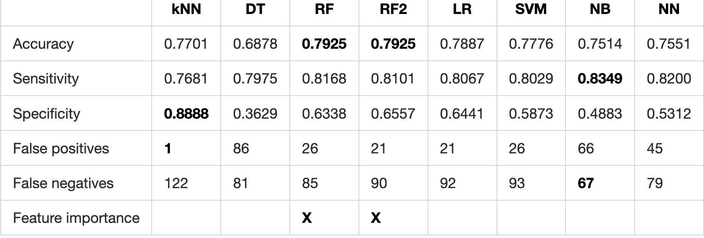
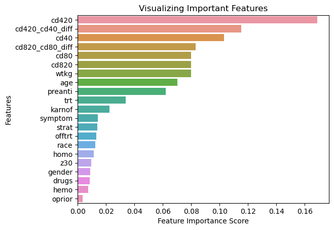

# Prediction of outcomes for patients with HIV/AIDS from early test and follow-up data

## NON-TECHNICAL EXPLANATION OF YOUR PROJECT
The project explores the predictive power of early test results and general health/demographic data on the survival outcome of patients with HIV. The aim of the project is to assess the predictive power of the data available early on, identifying the main risk factors for mortality and also to find the most suitable algorithm for predicting the risk of mortality for future patients from across a range of classification methods.

## DATA

This study uses the the AIDS Clinical Trials Group Study 175 Dataset which contains healthcare statistics and categorical information about patients who have been diagnosed with AIDS. This dataset was initially published in 1996 [[1]](https://archive.ics.uci.edu/dataset/890/aids+clinical+trials+group+study+175).

See details in the [Data sheet](data_sheed.md)

## MODEL 
Instead of a single model a collection of models is used to tackle the classification problem (deciding the likely outcome of the disease for patients). This is to exploit the advantages of each model as besides an accurate prediction, feature importance and individual risk prediction are also of interest.

The list of models considered:
- k-nearest neigbours method (kNN)
- Decison tree (DT)
- Random forest (RF)
- Logistic regression (LR)
- Support vector machines (SVM)
- Naive Bayes (NB)
- Neural Network (fully connected) (NN)

## HYPERPARAMETER OPTIMSATION

In the initial performance test of the models, the following was done to optimize hyperparameters:

- k-nearest neigbours method (kNN)
  - number of neighbours --> optimised by parameter sweep in the domain of interest
  
- Decison tree (DT) --> hyperparameters picked by hand/default used
- Random forest (RF) --> hyperparameters picked by hand/default used
- Logistic regression (LR) --> hyperparameters picked by hand/default used
- Support vector machines (SVM) --> hyperparameters picked by hand/default used
- Naive Bayes (NB) --> hyperparameters picked by hand
- Neural Network (fully connected) (NN) --> The following hyperparameters were tuned by Bayesian optimisation:
  - 'hidden_layer_sizes': Integer(1,100),
    'activation': Categorical(['tanh', 'relu']),
    'solver': Categorical(['sgd', 'adam']),
    'alpha': Real(1e-5, 1e-2, prior='log-uniform'),
    'learning_rate': Categorical(['constant', 'adaptive'])

    optimisation parameters: n_iter=100, 
    random_state=0,
    cv=StratifiedKFold(5),
    n_jobs=-1

Then after evaluating the initial results, I picked the best algorithm (RF) and used Bayesian Optimisation to fine-tune the following hyperparameters

'n_estimators': Integer(100, 2500),
'max_depth': Integer(3, 100),
'max_features': Categorical(['auto', 'sqrt', 'log2']),
'min_samples_split': Integer(2, 10),
'min_samples_leaf': Integer(1, 10),
'bootstrap': Categorical([True, False])

Optimisation parameters:

n_iter=1000,
random_state=0,
cv=StratifiedKFold(5),
n_jobs=4

The results for the resulting model are given in column **(RF2)**

## RESULTS

The results on model performance are summarised in the table below.:

In terms of accuracy, the **Random forest** model performs the best with 79.25% accuracy and this model is also useful as it provides insight into feature importance. Note that hyperparameter optimisation did not achieve an improvement in performance suggesting that the default parameters of the Random forest classifier already result in near ideal performance. (There are marginally more false negatives and less false positives in RF2 though.)

It can be argued however that with outcomes of HIV/AIDS not missing positive outcomes (i.e. patients who would die) is more important on an individual level, as such predictions could prompt further actions to prevent this. To this end, one may look at the false negatives and the sensitivity, in both of which metrics the **Naive Bayes** classifier performed best with 83.49% sensitivity and only 67 false negatives compared to 85 with the decision forest classifier.
At the other end of the scale, the **kNN** method has the best specificity, and has only 1 false positive, however, this is because only 9 fatalities were predicted in the test set, which resulted in the highest number of false negatives.

From the regression forest model we also obtain feature importance metrics.

These metrics indicate that the most important predictor of AIDS fatality is the CD4 immune cell count on week 20, followed by the variable indicating whether this is improved or declined compared to the initial measurement. Overall, the top 6 most important features are related to cell counts. This is not surprising as these are generally accepted as indicators of the progression of AIDS.

The cell count features are followed by biometric measures such as weight and age which indeed can correlate to the ability of an individual to fight a pathogen. Interestingly, the Karnofsky score which is also an indicator of a patient's condition is less predictive of the outcome.

The patient's history of preantiviral treatments is also a relatively strong predictor of fatality which is also mentioned in the original research paper [[2]](), i.e. those who were already exposed to such treatments reacted less well to treatment.

Interestingly, even though [[2]]() is a study on different treatments, the type of treatment used does not determine the outcome. There is a clear effect as shown by the statistics, but the differences in the outcomes for the four different treatment groups are less pronounced.

Note that after hyperparameter optimisation we get similar feature importances with only minor changes in order for features with a close importance score. (See details in this [[Notebook]](hyperpar_opt.ipynb)).

Other demographic features, e.g. race, gender, sexuality are amongst the least important ones indicating that the way of infection, i.e., how an individual acquired HIV is almost immaterial to the outcome.

## CONCLUSIONS

The results of the models indicate that early test results and general health/demographic data have a predictive power on the survival outcome of patients with HIV is promising. However, it is important to note that the accuracy of the models is around 80%, which means that it is far from being conclusive.

While an accuracy of 80% is a good indicator of risk, it is not a perfect tool for predicting individual outcomes. It is crucial to consider the false negatives and sensitivity metrics, which measure the ability of the models to correctly identify patients who are at risk of mortality. 

Based on the results, the Naive Bayes and Random Forest models have shown to be the most useful for predicting the risk of mortality in patients with HIV/AIDS. These models have demonstrated high sensitivity and relatively low false negatives, making them suitable for identifying patients at risk. Additionally, the Random Forest model provides insight into feature importance, which can help in understanding the factors contributing to AIDS fatality.

Furthermore, it is important to consider additional data sources that may provide valuable information for predicting the risk of mortality in patients with HIV/AIDS. This can include genetic data, additional medical tests, or social determinants of health. Incorporating these data sources into the models can enhance their predictive power and provide a more comprehensive understanding of the factors influencing AIDS fatality.
